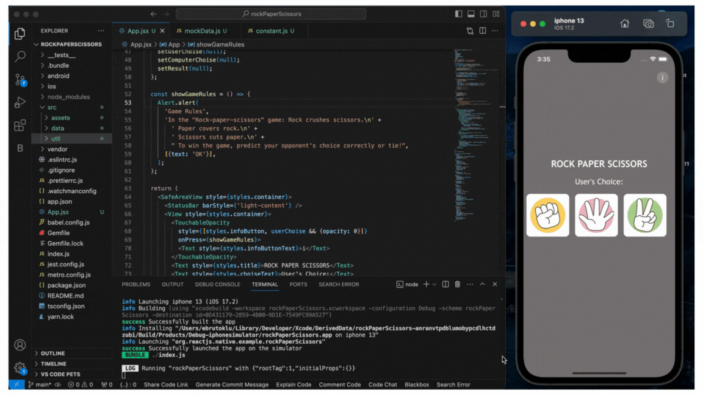

# Rock Paper Scissors Game

This is a simple "Rock Paper Scissors" game. The user makes a choice, and the computer makes a random selection, then the winner is determined.

## Libraries Used

- React Native
- React Hooks (useState)
- React Native components (View, Text, SafeAreaView, StyleSheet, StatusBar, TouchableOpacity, Image, Alert)

## Installation

1. Clone this project.
2. Navigate to the cloned directory and install dependencies using `npm install` or `yarn install`.
3. Run the project on an emulator or real device using React Native run commands (e.g., `npm run android` or `npm run ios`).

## How to Play?

1. Tap the "i" (info) button to learn the game rules.
2. Tap on the desired icon to make your selection.
3. Wait for the computer's selection.
4. See the result.
5. Tap the "Reset" button to play again.

## Game Rules

- Rock crushes scissors.
- Paper covers rock.
- Scissors cuts paper.
- To win, predict your opponent's choice correctly or tie!

## Resources

- Data and images are fetched from the `data` and `images` directories under `src`.

## License and Usage

This project is for educational purposes and not intended for commercial use. You are free to modify, reproduce, and distribute the project, but it is strongly recommended not to use this project in your own commercial projects.
